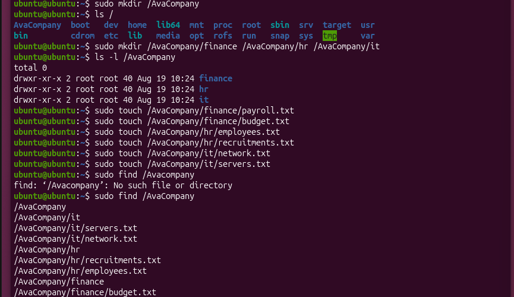
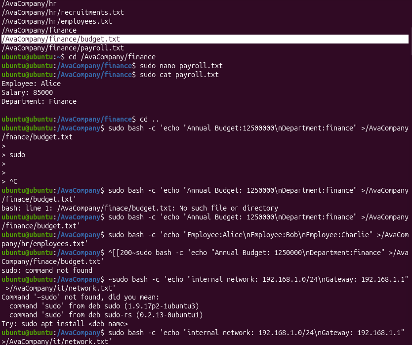
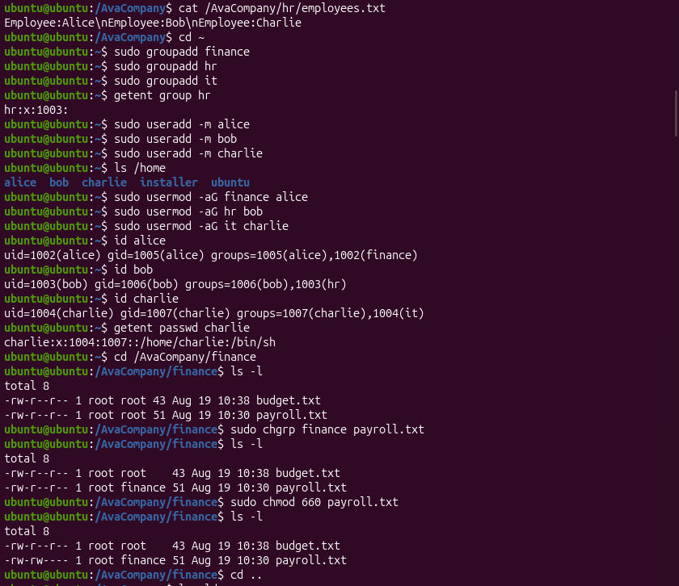
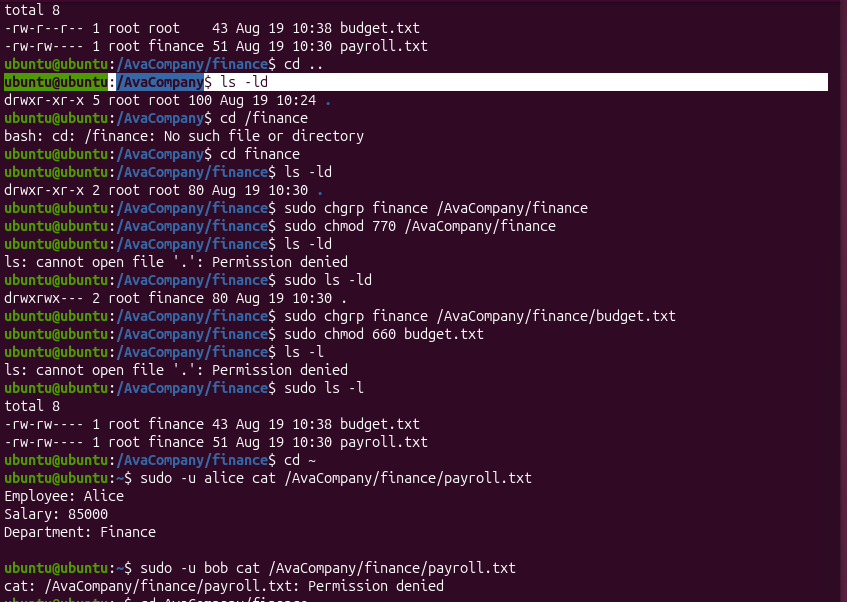

# Finding 1: Linux File Permissions and Access Control

## Objective

The objective of this security exercise was to create a controlled Linux file structure and implement appropriate file and directory permissions to restrict access to sensitive company information.

The exercise focused on:

- Linux file and directory permissions
- File ownership
- Group ownership
- User and group management
- Access control
- Permission verification
- Testing authorized and unauthorized access

## Environment

- **Operating System:** Ubuntu Linux
- **Virtualization:** VirtualBox
- **Shell:** Bash
- **Users:** Alice, Bob, Charlie
- **Groups:** Finance, HR, IT
- **Test Directory:** `/AvaCompany`

---

## 1. Creating the Company Directory Structure

A directory named `AvaCompany` was created at the root of the Ubuntu filesystem.

The following departmental directories were then created:

- Finance
- HR
- IT

```bash
sudo mkdir /AvaCompany
sudo mkdir /AvaCompany/finance /AvaCompany/hr /AvaCompany/it
```

The directory structure was verified using:

```bash
sudo ls -l /AvaCompany
```

### Evidence



---

## 2. Creating Department Files

Text files were created within each department directory to represent company resources.

### Finance

- `payroll.txt`
- `budget.txt`

### HR

- `employees.txt`
- `recruitments.txt`

### IT

- `network.txt`
- `servers.txt`

The files were created using:

```bash
sudo touch /AvaCompany/finance/payroll.txt
sudo touch /AvaCompany/finance/budget.txt
sudo touch /AvaCompany/hr/employees.txt
sudo touch /AvaCompany/hr/recruitments.txt
sudo touch /AvaCompany/it/network.txt
sudo touch /AvaCompany/it/servers.txt
```

---

## 3. Adding Sample Data

Sample information was added to the files to simulate sensitive departmental resources.

For example, the Finance payroll file contained:

```text
Employee: Alice
Salary: 85000
Department: Finance
```

The HR employees file contained employee names:

```text
Employee:Alice
Employee:Bob
Employee:Charlie
```

The Finance budget file contained annual budget and department information.

The contents were verified using commands such as:

```bash
cat /AvaCompany/hr/employees.txt
```

and:

```bash
sudo -u alice cat /AvaCompany/finance/payroll.txt
```

### Evidence



---

## 4. Creating Groups and Users

Department-specific Linux groups were created:

```bash
sudo groupadd finance
sudo groupadd hr
sudo groupadd it
```

The groups were verified using:

```bash
getent group hr
```

Three test users were created:

```bash
sudo useradd -m alice
sudo useradd -m bob
sudo useradd -m charlie
```

The users were assigned to their respective departmental groups:

```bash
sudo usermod -aG finance alice
sudo usermod -aG hr bob
sudo usermod -aG it charlie
```

User group membership was verified using:

```bash
id alice
id bob
id charlie
```

The results confirmed:

- Alice was a member of the `finance` group.
- Bob was a member of the `hr` group.
- Charlie was a member of the `it` group.

### Evidence



---

## 5. Changing File Group Ownership

The Finance payroll file initially belonged to the `root` group.

Its group ownership was changed to the `finance` group:

```bash
sudo chgrp finance payroll.txt
```

The ownership was then verified using:

```bash
ls -l
```

The file showed:

```text
root finance payroll.txt
```

This meant that the Finance group could now be used to control access to the payroll file.

---

## 6. Applying File Permissions

The Finance payroll file was assigned permission mode `660`:

```bash
sudo chmod 660 payroll.txt
```

The resulting permissions were verified using:

```bash
ls -l
```

The `660` permission mode provides:

```text
Owner  → read and write
Group  → read and write
Others → no permissions
```

Therefore, members of the Finance group could read and modify the file, while users who were not members of the group had no direct file permissions.

The Finance budget file was also assigned to the Finance group and given restrictive permissions:

```bash
sudo chgrp finance /AvaCompany/finance/budget.txt
sudo chmod 660 budget.txt
```

---

## 7. Testing Access Control

The permissions were tested using different Linux users.

### Authorized User

Alice was a member of the `finance` group.

Her access to the payroll file was tested using:

```bash
sudo -u alice cat /AvaCompany/finance/payroll.txt
```

Alice was able to read the file.

This demonstrated that the intended Finance user could access the protected resource.

### Unauthorized User

Bob was not a member of the `finance` group.

His access was tested using:

```bash
sudo -u bob cat /AvaCompany/finance/payroll.txt
```

The result was:

```text
Permission denied
```

This demonstrated that the permission configuration successfully restricted access to an unauthorized user.

### Evidence



---

## Security Issue Identified

Before the access controls were applied, the Finance files were owned by `root:root` and did not provide department-specific group-based access control.

This meant that the intended departmental access model had not yet been implemented.

The security requirement was to ensure that:

- Finance users could access Finance resources.
- HR users could access HR resources.
- IT users could access IT resources.
- Users outside the appropriate department could not access protected resources.

---

## Remediation

The access control model was implemented by:

1. Creating department-specific groups.
2. Creating separate users for testing.
3. Assigning users to their appropriate groups.
4. Changing the group ownership of Finance files.
5. Applying restrictive file permissions.
6. Testing access using authorized and unauthorized users.

For the Finance payroll file, the final configuration used:

```text
Owner: root
Group: finance
Permissions: 660
```

This provided read/write access to the file owner and members of the Finance group while removing permissions for other users.

---

## Verification

The implemented controls were tested by attempting to access the protected Finance payroll file using different users.

| User | Department Group | Expected Access | Result |
|---|---|---|---|
| Alice | finance | Allowed | Access granted |
| Bob | hr | Denied | Permission denied |


The testing demonstrated that group-based permissions were functioning as intended.

---

## Security Outcome

The exercise successfully demonstrated the use of Linux file permissions and group-based access control to protect departmental resources.

The final configuration ensured that access to sensitive Finance files was restricted according to group membership.

This demonstrated practical understanding of:

- Linux permissions
- File ownership
- Group ownership
- `chmod`
- `chgrp`
- User management
- Group management
- Access control
- Permission testing
- Security verification

## Conclusion

The security control was successfully implemented and verified in the Ubuntu virtual machine.

The exercise demonstrated that Linux file permissions can be combined with user and group management to enforce least-privilege access to departmental resources.

All testing was performed in a controlled virtual machine environment for educational and portfolio purposes.
