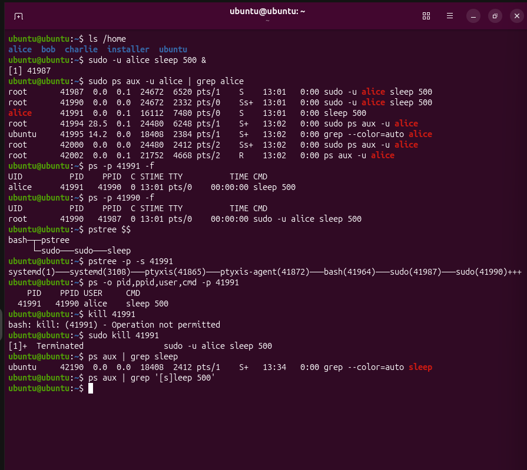

# Finding 2: Linux Process Monitoring

## Objective

The objective of this exercise was to create, identify, investigate, and safely terminate a test Linux process while examining its process ID (PID), parent process ID (PPID), user ownership, and parent-child process relationships.

The exercise focused on:

- Process creation
- PID identification
- PPID identification
- Process ownership
- Parent-child process relationships
- Process inspection
- Permission testing
- Process termination
- Verification

## Environment

- **Operating System:** Ubuntu Linux
- **Virtualization:** VirtualBox
- **Shell:** Bash
- **Test User:** Alice
- **Test Process:** `sleep 500`

---

## 1. Creating a Test Process

A controlled test process was created under the `alice` user account using the `sleep` command:

```bash
sudo -u alice sleep 500 &
```

The `&` operator allowed the process to run in the background while the terminal remained available for investigation.

The command returned:

```text
[1] 41987
```

The returned process information was then investigated to identify the actual `sleep` process.

---

## 2. Identifying the Process

The running processes associated with Alice were reviewed using:

```bash
sudo ps aux -u alice | grep alice
```

The output showed the `sleep` process:

```text
alice    41991  0.0  0.1  16112  7480 pts/0    S   13:01   0:00 sleep 500
```

The process was therefore identified as:

```text
PID: 41991
User: alice
Command: sleep 500
```

---

## 3. Identifying the PID and PPID

The process was inspected using:

```bash
ps -p 41991 -f
```

The output showed:

```text
UID        PID  PPID  C STIME TTY          TIME CMD
alice    41991 41990  0 13:01 pts/0    00:00:00 sleep 500
```

This established:

```text
PID  = 41991
PPID = 41990
User = alice
```

The parent process was then investigated:

```bash
ps -p 41990 -f
```

The output showed:

```text
UID        PID  PPID  C STIME TTY          TIME CMD
root     41990 41987  0 13:01 pts/0    00:00:00 sudo -u alice sleep 500
```

This showed that process `41990` was the immediate parent of process `41991`.

---

## 4. Examining the Parent-Child Process Relationship

The process tree was examined using:

```bash
pstree $$
```

The output showed the process relationship:

```text
bash
 └── sudo
      └── sudo
           └── sleep
```

The complete ancestry of the `sleep` process was then displayed using:

```bash
pstree -p -s 41991
```

The resulting process chain was:

```text
systemd(1)
 └── systemd(3108)
      └── ptyxis(41865)
           └── ptyxis-agent(41872)
                └── bash(41964)
                     └── sudo(41987)
                          └── sudo(41990)
                               └── sleep(41991)
```

This demonstrated how Linux processes can form a parent-child hierarchy.

---

## 5. Inspecting the Process

The process was further inspected using:

```bash
ps -o pid,ppid,user,cmd -p 41991
```

The output was:

```text
PID  PPID USER     CMD
41991 41990 alice  sleep 500
```

This confirmed:

- **PID:** `41991`
- **PPID:** `41990`
- **User:** `alice`
- **Command:** `sleep 500`

---

## 6. Testing Process Termination Permissions

An attempt was made to terminate the process without elevated privileges:

```bash
kill 41991
```

The system returned:

```text
bash: kill: (41991) - Operation not permitted
```

This demonstrated that the current user did not have sufficient permission to terminate the process owned by another user.

The process was then terminated using elevated privileges:

```bash
sudo kill 41991
```

The terminal confirmed termination:

```text
[1]+  Terminated              sudo -u alice sleep 500
```

---

## Security Issue Identified

The investigation demonstrated that process ownership and Linux permissions affect the ability to manage running processes.

The test process was owned by the `alice` account while the investigation was performed from another user context. Attempting to terminate the process without appropriate privileges resulted in:

```text
Operation not permitted
```

This demonstrated Linux's protection against unauthorized process management.

---

## Remediation and Control

The process was safely terminated using administrative privileges:

```bash
sudo kill 41991
```

This allowed the controlled test process to be stopped without affecting unrelated system processes.

The investigation also demonstrated the importance of checking process ownership and permissions before attempting to manage a process.

---

## Verification

The process termination was confirmed by the terminal message:

```text
[1]+  Terminated              sudo -u alice sleep 500
```

The investigation therefore successfully demonstrated:

1. Process creation
2. PID identification
3. PPID identification
4. Process ownership
5. Parent-child process analysis
6. Permission enforcement
7. Privileged process termination

---

## Evidence

The process-monitoring investigation was captured in the following screenshot:



---

## Security Outcome

The exercise demonstrated practical Linux process-monitoring and process-management skills.

It showed how to:

- Identify running processes
- Determine PID and PPID values
- Trace process ancestry
- Determine process ownership
- Investigate parent-child relationships
- Recognize permission restrictions
- Use `sudo` for authorized process management
- Safely terminate a controlled process

## Conclusion

The process-monitoring exercise was successfully completed in the Ubuntu virtual machine.

The investigation demonstrated that Linux processes are organized into parent-child relationships and that process-management operations are subject to user permissions and ownership.

The exercise was performed in a controlled virtual machine environment for educational and portfolio purposes.
